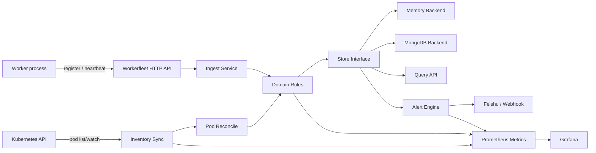
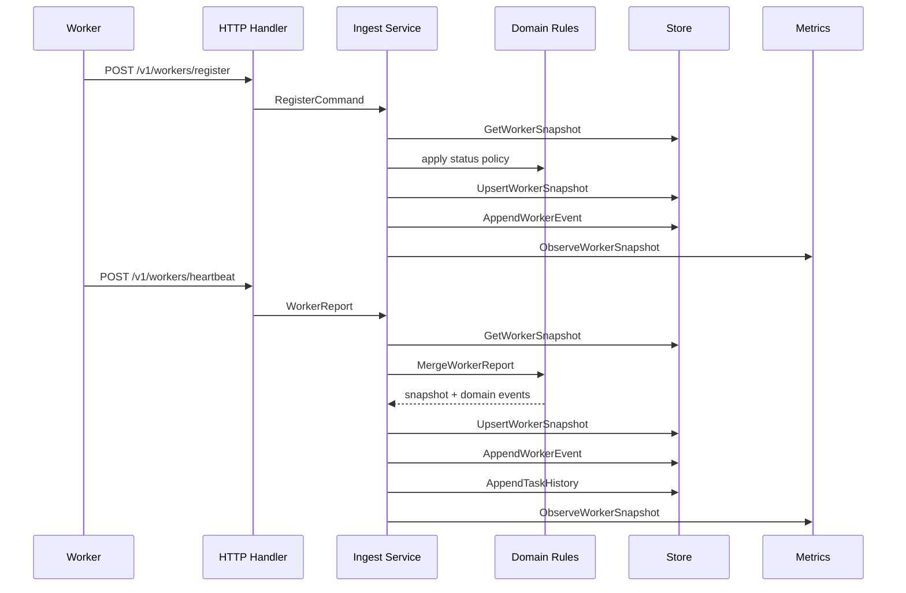

# Workerfleet Technical Design

## 1. Background

Workerfleet is a Plumego-based reference application for monitoring simulation workers running in Kubernetes. The target production shape is one Kubernetes pod per worker, around 8000 pods in one cluster, with each worker process able to run multiple tasks concurrently.

The service answers these operational questions:

- Is each worker online, degraded, offline, or unknown?
- Is the worker process alive and able to accept new tasks?
- Which tasks are currently running on each worker?
- What phase is each current task in?
- When was the worker last connected?
- Which pods or nodes show abnormal state distribution?
- Which alerts are firing or recently resolved?

The app is intentionally placed under `reference/workerfleet` as an app-local reference service. Workerfleet-specific storage, MongoDB dependencies, metrics, alerting, and Kubernetes logic must stay inside this submodule and must not expand Plumego stable roots.

## 2. Scope And Assumptions

In scope:

- Single Kubernetes cluster.
- One pod maps to one worker.
- One worker can run multiple tasks concurrently.
- Worker online state means the worker process is alive and can accept tasks, not just that it recently sent a heartbeat.
- Current tasks require task phase and phase name, but not progress percentage or ETA.
- Current state plus seven-day historical task, event, and alert records.
- Feishu and generic webhook notification channels.
- Prometheus metrics for later Grafana visualization.

Out of scope for this phase:

- Multi-cluster routing or aggregation.
- Per-task progress percentage and ETA.
- Distributed task scheduling.
- Strong exactly-once notification delivery.
- Adding workerfleet-specific APIs or dependencies to Plumego stable packages.

## 3. High-Level Architecture

Layer responsibilities:

- `main.go`: thin process entrypoint that loads config, constructs the app, and runs it.
- `internal/app`: application bootstrap, explicit dependency wiring, the HTTP-facing service facade, runtime lifecycle shell, loop runners, alert runners, route registrar invocation, and graceful shutdown orchestration.
- `internal/handler`: HTTP request and response layer.
- `internal/domain`: worker status rules, task reconciliation, pod reconciliation, alerts, domain events.
- `internal/platform/store`: app-local storage interfaces and shared query/filter types.
- `internal/platform/store/memory`: local in-memory backend.
- `internal/platform/store/mongo`: MongoDB persistence backend.
- `internal/platform/kube`: Kubernetes pod mapping, pod list/watch client, inventory sync.
- `internal/platform/metrics`: workerfleet Prometheus collector, exporter, and instrumentation observer.
- `internal/platform/notifier`: Feishu and generic webhook notification sinks.

## 4. Module Boundary Policy

Workerfleet is a standalone Go module:

- Module path: `workerfleet`
- Location: `reference/workerfleet`
- Plumego root dependency: `replace github.com/spcent/plumego => ../..`
- MongoDB dependencies: only in `reference/workerfleet/go.mod`

Boundary rules:

- Stable Plumego roots must not import workerfleet packages.
- Workerfleet domain must not depend on HTTP, MongoDB, Kubernetes, or Prometheus packages.
- Metrics are injected as explicit optional observers, not hidden globals.
- Storage dependencies are behind app-local interfaces.
- No workerfleet-specific labels, stores, or alert rules are added to Plumego stable packages.

Runtime wiring notes:

- `Runtime` is intentionally kept as a lifecycle shell rather than the default owner of every business dependency.
- Bootstrap wires explicit components for ingest, query, loop execution, and alert evaluation, then exposes only the lifecycle hooks needed by `App`.
- Periodic Kubernetes sync and status sweep logic live behind `LoopRunner`.
- Periodic alert evaluation and notification delivery live behind `AlertRunner`.
- App config owns the profile-selected `StatusPolicy` and `AlertPolicy` values; bootstrap validates them at startup and injects the effective policies into ingest, loop, and alert components explicitly.

## 5. Domain Model

Worker identity:

- `worker_id`
- `namespace`
- `pod_name`
- `pod_uid`
- `node_name`
- `container_name`
- `image`
- `version`

Worker runtime:

- `process_alive`
- `accepting_tasks`
- `last_seen_at`
- `last_ready_at`
- `last_heartbeat_at`
- `last_error`
- `restart_count`

Worker status:

- `online`
- `degraded`
- `offline`
- `unknown`

Policy surface:

- `StatusPolicy` owns heartbeat stale/offline thresholds plus stage-stuck and restart thresholds used by status evaluation.
- `AlertPolicy` owns alert-side stage-stuck and restart thresholds and is derived from defaults unless runtime wiring overrides it explicitly.
- `internal/app/config.go` exposes both policies through env-driven app config, with `dev` and `prod` profile defaults plus validated per-field overrides.
- the same app config layer also owns whether experimental pod, exec-plan, and case-step metrics are emitted.

Online means the process is alive and ready to accept tasks. A worker can still be online while busy when it has active tasks but is not accepting additional work. A worker becomes degraded when signals are stale, it reports errors, it is not accepting tasks while idle, or task phases are stuck. A worker becomes offline when the process is not alive, the pod has failed, the pod has disappeared, or heartbeat expiry crosses policy thresholds.

Task phases:

- `unknown`
- `queued`
- `preparing`
- `running`
- `finalizing`
- `succeeded`
- `failed`
- `canceled`

Each worker heartbeat reports the full active-task set. The service treats `active_tasks` as a replacement snapshot, not a delta stream.

## 6. Worker Ingest Flow

Register flow:

- merges worker identity into the current snapshot.
- evaluates initial status.
- writes a `worker_registered` event when the worker is new.

Heartbeat flow:

- updates process liveness and readiness.
- replaces the active-task set.
- emits task start, phase change, finish, heartbeat, readiness, and status transition events.
- persists task history for completed tasks.
- updates Prometheus counters, gauges, and histograms through the metrics observer.

## 7. Kubernetes Inventory Sync

Kubernetes inventory sync maps pod state into worker snapshots. It is designed to reconcile platform truth with worker-reported truth.

Inputs:

- Kubernetes API host.
- Namespace.
- Label selector.
- Worker container name.
- Service account token or explicit bearer token.

Required RBAC:

- `get`, `list`, and `watch` on pods in the target namespace.

Pod mapping:

- pod name and UID become worker identity fields.
- namespace and node name come from pod metadata/spec.
- container image and restart count come from the selected worker container.
- pod phase maps to worker pod phase.

Reconciliation behavior:

- pod restart count increases emit pod restart events.
- pod disappearance marks pod deletion.
- failed or succeeded pods push worker status toward offline.
- pod metrics are exported as aggregate low-cardinality gauges.

Implemented runtime behavior:

- `internal/platform/kube` sync primitives are wired into the app runtime.
- When `WORKERFLEET_KUBE_SYNC_ENABLED=true`, `internal/app` starts a periodic Kubernetes sync loop.
- The runtime loop scheduler prevents same-process overlap, applies a default `25s` per-iteration timeout, and backs off from `5s` up to `1m` after failures.
- Sync errors are reported through the runtime error observer and exported through low-cardinality metrics instead of being silently discarded.
- Loop scheduling routes through `LoopLeaseCoordinator`; Mongo storage wires this to the `loop_leases` collection, while memory storage remains process-local.
- The loop is stopped during graceful shutdown before the runtime store is closed.

Current replica assumption:

- With Mongo storage, Kubernetes sync, status sweep, and alert evaluation loops acquire one lease per loop family before doing work.
- With memory storage, leases are process-local and enabled loops should still run as a single replica.
- The reference deployment remains `replicas: 1` by default; operators may raise replicas only after confirming Mongo storage, unique lease owners, and external notification expectations.

## 8. Storage Design

Store interfaces are app-local under `internal/platform/store`.

Current state collections:

- `worker_snapshots`: one current snapshot per worker.
- `worker_active_tasks`: one current task projection per active task.

History collections:

- `task_history`
- `case_step_history`
- `worker_events`
- `alert_events`

Retention:

- task history: seven days.
- case step history: seven days.
- worker events: seven days.
- alert events: seven days.
- current worker snapshots and active-task projections are not TTL-pruned.

MongoDB behavior:

- startup validates Mongo URI and database before handlers are exposed.
- startup pings MongoDB and ensures indexes.
- history writes are append-only from the app perspective.
- generated duplicate history IDs are treated as idempotent retry success.
- `expire_at` drives TTL cleanup for history and alert collections.
- `case_step_history` supports case timeline and exec-plan drilldown in the
  production MongoDB backend.

Memory backend:

- default local backend.
- intended for local development, tests, and demos.
- not a production persistence option for 8000 workers.

## 9. HTTP API Design

Base path: `/v1`

Core endpoints:

- `POST /v1/workers/register`
- `POST /v1/workers/heartbeat`
- `GET /v1/workers`
- `GET /v1/workers/:worker_id`
- `GET /v1/tasks/:task_id`
- `GET /v1/fleet/summary`
- `GET /v1/alerts`
- `GET /metrics`

Response rules:

- success responses use the existing workerfleet handler envelope.
- errors use Plumego `contract.WriteError`.
- route wiring is explicit, one method plus one path plus one handler per registration line.

Query behavior:

- workers can be filtered by status, namespace, node, task type, and accepting-task state.
- alerts can be filtered by worker, alert type, and status.
- task lookup checks current active-task projection first, then latest task history.

## 10. Metrics And Grafana

Metrics are exported through `GET /metrics` in Prometheus text format.

Metric goals:

- fleet size by worker status.
- pod phase distribution.
- active case count by namespace, node, task type, and phase.
- active case count by node.
- task start and finish rates.
- task phase transition rates.
- phase and total task duration histograms.
- case total duration distribution by node and pod.
- case step duration distribution by node, pod, step, and controlled exec plan.
- worker status transition counters.
- alert emission counters and firing gauges.
- ingest and Kubernetes sync operation durations.
- optional pod-level worker state, heartbeat age, active case count, throughput,
  and duration distribution when experimental metrics are enabled.

Default labels:

- `namespace`
- `node`
- `status`
- `phase`
- `task_type`
- `alert_type`
- `severity`
- `from_phase`
- `to_phase`
- `from_status`
- `to_status`
- `operation`
- `result`

Forbidden labels:

- `task_id`
- `case_id`
- `worker_id`
- `pod_name`
- `pod_uid`

Experimental metrics intentionally allow `pod` on selected metrics because pod-level throughput and duration distribution are explicit business requirements. `exec_plan_id` is optional and should only be enabled when active plan cardinality is bounded. The `prod` profile disables these pod, exec-plan, and step-heavy series by default.

Grafana dashboards should stay aggregate-first. Per-case and per-task drilldown should use workerfleet APIs and MongoDB history instead of high-cardinality Prometheus labels. The complete case/step metric plan is documented in [Case And Step Metrics Design](../case-step-metrics.md).

## 11. Alerting And Notification

Initial alert types:

- `worker_offline`
- `worker_degraded`
- `worker_not_accepting_tasks`
- `worker_no_heartbeat`
- `worker_stage_stuck`
- `pod_restart_burst`
- `pod_missing`
- `task_conflict`

Alert state:

- `firing`
- `resolved`

Dedupe:

- worker-scoped alerts use `alert_type:worker_id`.
- task conflict alerts use `alert_type:task_id`.

Notification channels:

- Feishu webhook.
- Generic JSON webhook.

Implemented runtime behavior:

- Alert evaluation and notifier primitives are wired into the app runtime.
- When `WORKERFLEET_ALERT_EVALUATION_ENABLED=true`, `internal/app` starts a periodic alert evaluation loop.
- When `WORKERFLEET_NOTIFICATION_ENABLED=true`, emitted alert records are dispatched through configured notifiers with `WORKERFLEET_NOTIFIER_DELIVERY_TIMEOUT`.
- Startup fails when notification delivery is enabled without a configured
  Feishu or generic webhook URL.
- Alert evaluation uses the same guarded loop scheduler, including non-overlap, per-iteration timeout, and bounded failure backoff.
- Evaluation and notification errors are reported through the runtime error observer and exported through low-cardinality metrics instead of being silently discarded.
- The alert loop is stopped during graceful shutdown before the runtime store is closed.

## 12. Runtime Configuration

HTTP:

- `WORKERFLEET_HTTP_ADDR`, default `:8080`
- `WORKERFLEET_SHUTDOWN_TIMEOUT`, default `10s`

Storage:

- `WORKERFLEET_STORE_BACKEND=memory|mongo`
- `WORKERFLEET_MONGO_URI`
- `WORKERFLEET_MONGO_DATABASE`
- `WORKERFLEET_MONGO_CONNECT_TIMEOUT`
- `WORKERFLEET_MONGO_OPERATION_TIMEOUT`
- `WORKERFLEET_MONGO_MAX_POOL_SIZE`
- `WORKERFLEET_RETENTION_DAYS`, greater than zero and no more than 106751 days

Runtime loop configuration:

- `WORKERFLEET_KUBE_SYNC_ENABLED`, default `false`.
- `WORKERFLEET_STATUS_SWEEP_ENABLED`, default `false`.
- `WORKERFLEET_ALERT_EVALUATION_ENABLED`, default `false`.
- `WORKERFLEET_NOTIFICATION_ENABLED`, default `false`.
- `WORKERFLEET_KUBE_SYNC_INTERVAL`, default `30s`.
- `WORKERFLEET_STATUS_SWEEP_INTERVAL`, default `30s`.
- `WORKERFLEET_ALERT_EVALUATION_INTERVAL`, default `30s`.
- Loop guardrail defaults: per-iteration timeout `25s`, initial failure backoff `5s`, max failure backoff `1m`.
- `WORKERFLEET_NOTIFIER_DELIVERY_TIMEOUT`, default `5s`.
- `WORKERFLEET_LOOP_LEASE_TTL`, default `90s`.
- `WORKERFLEET_LOOP_LEASE_OWNER`, default host name.
- `WORKERFLEET_KUBE_API_HOST`.
- `WORKERFLEET_KUBE_BEARER_TOKEN`.
- `WORKERFLEET_KUBE_NAMESPACE`.
- `WORKERFLEET_KUBE_LABEL_SELECTOR`.
- `WORKERFLEET_KUBE_WORKER_CONTAINER`, default `worker`.
- `WORKERFLEET_FEISHU_WEBHOOK_URL`.
- `WORKERFLEET_WEBHOOK_URL`.
- `WORKERFLEET_WEBHOOK_HEADERS`, comma-separated `Header=Value` pairs.

Worker ingress auth:

- `WORKERFLEET_WORKER_AUTH_TOKEN` enables Bearer-token auth for worker registration and heartbeat ingress.
- `WORKERFLEET_PROFILE=prod` requires `WORKERFLEET_WORKER_AUTH_TOKEN` at startup.

Query API auth:

- `WORKERFLEET_ADMIN_AUTH_TOKEN` enables Bearer-token auth for worker, task, fleet summary, and alert query endpoints.
- `WORKERFLEET_QUERY_AUTH_REQUIRED=true` requires `WORKERFLEET_ADMIN_AUTH_TOKEN` outside production.
- `WORKERFLEET_PROFILE=prod` requires `WORKERFLEET_ADMIN_AUTH_TOKEN` at startup.
- Health, readiness, and metrics endpoints remain outside query API auth in this reference service.

## 13. Capacity And Reliability Considerations

Target scale:

- around 8000 workers.
- multiple active tasks per worker.
- single cluster.

Key design choices for scale:

- heartbeats replace full active-task sets to avoid server-side partial merge ambiguity.
- current worker snapshots are stored separately from historical append-only records.
- active tasks have a reverse lookup projection for task detail queries.
- Prometheus labels avoid worker ID, task ID, case ID, and pod name.
- Mongo indexes are created at startup for current-state and lookup paths.

Operational risks:

- simultaneous heartbeat bursts can create write pressure.
- full active-task replacement requires workers to report complete state correctly.
- stale pod inventory can delay pod failure visibility until sync recovers.
- notification delivery failures can delay external visibility while persisted alert records remain queryable.

Mitigations:

- keep HTTP handlers thin and persistence writes explicit.
- use MongoDB connection pooling and operation timeouts.
- keep worker status policy deterministic and test-covered.
- expose ingest and inventory sync duration metrics.
- use Grafana aggregate panels before drilling into APIs.

Multi-replica lease implementation:

- ownership unit: one lease per runtime loop family, at minimum `kube_sync`, `status_sweep`, and `alert_evaluate`.
- lease backend: reuse the workerfleet Mongo backend when enabled so replicated deployments do not need a second coordination system.
- lease document shape: `_id` loop name, `owner_id`, `created_at`, `updated_at`, and `expires_at`.
- renewal model: the active holder renews on every loop interval; non-holders skip work and retry acquisition after the normal scheduler interval.
- failure model: if the holder stops renewing before `expire_at`, another replica may acquire the lease and resume loop ownership.
- remaining roadmap: expose lease state metrics and debug visibility before raising the reference deployment above one replica by default.

## 14. Security And Failure Policy

Security requirements:

- do not log webhook secrets, bearer tokens, private keys, or signatures.
- worker registration and heartbeat ingress fail closed when `WORKERFLEET_WORKER_AUTH_TOKEN` is configured.
- query endpoints fail closed when query API auth is required.
- fail closed when required Mongo config is missing.
- use explicit service account or bearer token for Kubernetes API access.
- keep notification headers out of error messages.

Failure behavior:

- invalid startup config prevents handler exposure.
- nil metrics observers are safe and do not block business flow.
- notifier errors are returned to the dispatcher.
- runtime loop errors are observed through `workerfleet_runtime_errors_total` with operation and error-class labels.
- storage errors propagate to HTTP handlers as structured errors.

## 15. Implementation Status

Implemented:

- workerfleet submodule with module path `workerfleet`.
- HTTP worker register, heartbeat, list, detail, task, fleet summary, and alert query routes.
- app bootstrap with memory and Mongo backends.
- Mongo schema, indexes, snapshot, active task, case-step history, task history, event, and alert persistence.
- domain worker status, active-task reconciliation, pod reconciliation, and alert rules.
- Feishu and generic webhook notifier primitives.
- Prometheus collector, exporter, instrumentation, and `/metrics` route.
- service entrypoint with HTTP server startup and graceful shutdown.
- periodic Kubernetes inventory sync, status sweep, alert evaluation, and alert notification loops.
- runtime env config for Kubernetes and notifiers.
- reference Kubernetes deployment, scraping, and baseline alerting manifests.
- Grafana dashboard planning documentation.
