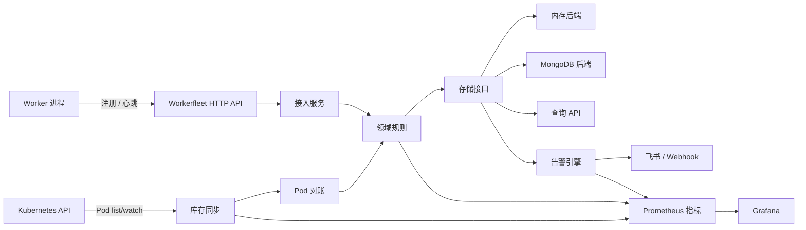
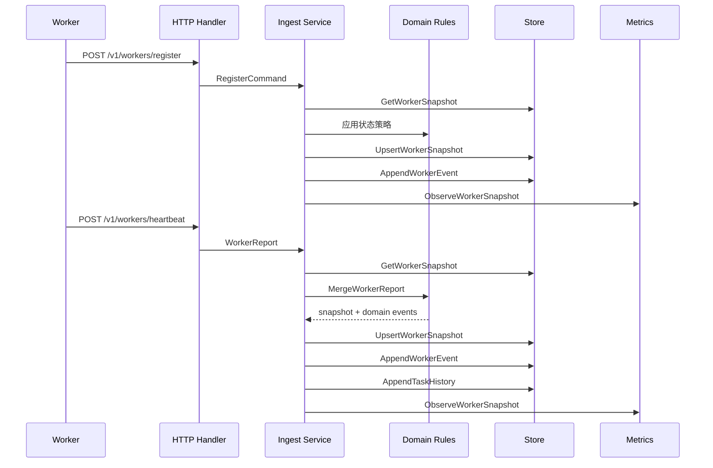

# Workerfleet 技术方案设计

## 1. 背景

Workerfleet 是一个基于 Plumego 的 worker 任务监控参考应用，用于监控 Kubernetes 中运行仿真任务的 worker。目标生产形态是一组约 8000 个 Pod，每个 Pod 对应一个 worker，每个 worker 进程可以并发运行多个任务。

该服务需要回答这些运维问题：

- 每个 worker 当前是在线、降级、离线，还是未知状态？
- worker 进程是否存活，并且是否能接新任务？
- 每个 worker 当前正在运行哪些任务？
- 当前每个任务处于哪个阶段？
- worker 上一次联通时间是什么时候？
- 哪些 Pod 或 Node 的状态分布异常？
- 当前有哪些告警正在触发，哪些告警刚恢复？

应用放在 `reference/workerfleet` 下，作为业务监控参考服务存在。Workerfleet 专属的存储、MongoDB 依赖、指标、告警和 Kubernetes 逻辑都必须留在该子模块内，不能扩展 Plumego 的稳定根模块。

## 2. 范围和前提

本阶段范围：

- 单 Kubernetes 集群。
- 一个 Pod 对应一个 worker。
- 一个 worker 可以并发运行多个任务。
- “在线”定义为 worker 进程存活且具备接任务能力，不只是最近有心跳。
- 当前任务需要任务阶段和阶段名，不要求进度百分比和 ETA。
- 保留当前状态，以及 7 天任务历史、worker 事件和告警历史。
- 支持飞书和通用 Webhook 通知渠道。
- 输出 Prometheus 指标，后续在 Grafana 中可视化。

本阶段不做：

- 多集群聚合或路由。
- 单任务进度百分比和 ETA。
- 分布式任务调度。
- 通知投递的严格 exactly-once 语义。
- 将 workerfleet 专属 API 或依赖加入 Plumego 稳定模块。

## 3. 总体架构

分层职责：

- `main.go`：进程入口、环境变量配置、路由注册、HTTP 服务生命周期、优雅关闭。
- `internal/app`：应用启动、显式依赖注入、service 方法、路由注册。
- `internal/handler`：HTTP 请求解析和响应层。
- `internal/domain`：worker 状态规则、任务对账、Pod 对账、告警、领域事件。
- `internal/platform/store`：应用本地存储接口和查询过滤类型。
- `internal/platform/store/memory`：本地内存后端。
- `internal/platform/store/mongo`：MongoDB 持久化后端。
- `internal/platform/kube`：Kubernetes Pod 映射、Pod list/watch 客户端、库存同步。
- `internal/platform/metrics`：workerfleet 专属 Prometheus collector、exporter 和 instrumentation observer。
- `internal/platform/notifier`：飞书和通用 Webhook 通知实现。

## 4. 模块边界

Workerfleet 是独立 Go 子模块：

- Module path：`workerfleet`
- 位置：`reference/workerfleet`
- Plumego 根模块依赖：`replace github.com/spcent/plumego => ../..`
- MongoDB 依赖：只允许出现在 `reference/workerfleet/go.mod`

边界规则：

- Plumego 稳定根模块不能 import workerfleet 包。
- Workerfleet domain 不能依赖 HTTP、MongoDB、Kubernetes 或 Prometheus 包。
- Metrics 通过显式可选 observer 注入，不能使用隐藏全局 collector。
- 存储依赖必须通过应用本地接口隔离。
- 不能把 workerfleet 专属 label、store 或 alert rule 放到 Plumego 稳定包中。

## 5. 领域模型

Worker 标识：

- `worker_id`
- `namespace`
- `pod_name`
- `pod_uid`
- `node_name`
- `container_name`
- `image`
- `version`

Worker 运行态：

- `process_alive`
- `accepting_tasks`
- `last_seen_at`
- `last_ready_at`
- `last_heartbeat_at`
- `last_error`
- `restart_count`

Worker 状态：

- `online`
- `degraded`
- `offline`
- `unknown`

在线定义为进程存活且可以接新任务。当 worker 有活跃任务但暂时不接更多任务时，它可以仍然被认为在线且忙碌。当信号过期、worker 上报错误、空闲但不接任务、或任务阶段卡住时，状态会变为降级。当进程不存活、Pod 失败、Pod 消失、或心跳超过离线阈值时，状态会变为离线。

任务阶段：

- `unknown`
- `queued`
- `preparing`
- `running`
- `finalizing`
- `succeeded`
- `failed`
- `canceled`

每次 worker 心跳都上报完整 active-task 集合。服务将 `active_tasks` 视为全量替换快照，而不是增量事件流。

## 6. Worker 接入流程

注册流程：

- 合并 worker identity 到当前快照。
- 计算初始状态。
- 新 worker 写入 `worker_registered` 事件。

心跳流程：

- 更新进程存活和接任务状态。
- 替换 active-task 集合。
- 产生任务开始、阶段变化、任务完成、心跳、ready 状态变化、worker 状态变化事件。
- 对完成任务写入任务历史。
- 通过 metrics observer 更新 Prometheus counter、gauge 和 histogram。

## 7. Kubernetes 库存同步

Kubernetes 库存同步用于把平台侧 Pod 状态映射到 worker 快照中，用平台事实和 worker 上报事实做对账。

输入：

- Kubernetes API host。
- Namespace。
- Label selector。
- Worker container name。
- Service account token 或显式 bearer token。

最低 RBAC：

- 目标 namespace 下 Pod 的 `get`、`list`、`watch` 权限。

Pod 映射：

- Pod name 和 UID 映射为 worker identity 字段。
- namespace 和 node name 来自 Pod metadata/spec。
- container image 和 restart count 来自选中的 worker container。
- Pod phase 映射为 worker pod phase。

对账行为：

- restart count 增加时产生 Pod 重启事件。
- Pod 消失时标记删除时间。
- Pod failed 或 succeeded 会推动 worker 状态进入离线。
- Pod 指标按低基数聚合 gauge 输出。

当前实现状态：

- `internal/platform/kube` 中已有 sync 基础能力。
- 当前 HTTP 服务入口尚未启动后台 Kubernetes 同步循环。该循环应作为独立运行时卡片补齐，并显式定义 interval、错误处理和关闭策略。

## 8. 存储设计

存储接口位于 `internal/platform/store`，属于 workerfleet 应用本地接口。

当前状态集合：

- `worker_snapshots`：每个 worker 一条当前快照。
- `worker_active_tasks`：每个活跃任务一条当前投影，用于 task_id 反查。

历史集合：

- `task_history`
- `worker_events`
- `alert_events`

保留策略：

- task history：7 天。
- worker events：7 天。
- alert events：7 天。
- 当前 worker snapshot 和 active-task projection 不走 TTL 清理。

MongoDB 行为：

- 启动时校验 Mongo URI 和 database，失败则不暴露 handler。
- 启动时 ping MongoDB 并确保索引存在。
- 历史写入从应用视角是 append-only。
- 重试导致的重复生成文档 ID 视为幂等成功。
- `expire_at` 用于历史和告警集合的 TTL 清理。

内存后端：

- 默认本地后端。
- 用于本地开发、测试和 demo。
- 不作为 8000 worker 生产场景的持久化方案。

## 9. HTTP API 设计

Base path：`/v1`

核心端点：

- `POST /v1/workers/register`
- `POST /v1/workers/heartbeat`
- `GET /v1/workers`
- `GET /v1/workers/:worker_id`
- `GET /v1/tasks/:task_id`
- `GET /v1/fleet/summary`
- `GET /v1/alerts`
- `GET /metrics`

响应规则：

- 成功响应使用现有 workerfleet handler envelope。
- 错误响应使用 Plumego `contract.WriteError`。
- 路由显式注册，每行一个 method、path 和 handler。

查询行为：

- worker 可按 status、namespace、node、task type、accepting-task 状态过滤。
- alert 可按 worker、alert type、status 过滤。
- task 查询先查当前 active-task projection，再查最新 task history。

## 10. Metrics 和 Grafana

指标通过 `GET /metrics` 以 Prometheus text format 暴露。

指标目标：

- 按 worker status 统计 fleet size。
- Pod phase 分布。
- pod 维度 worker 状态、心跳年龄和 active case 数。
- pod 维度 case 吞吐，包括每小时成功数和失败数。
- 按 namespace、node、task type、phase 统计 active case。
- 按 node 统计 active case。
- 任务开始和完成速率。
- 任务阶段转换速率。
- 阶段耗时和任务总耗时 histogram。
- 按 node 和 pod 统计 case 总耗时分布。
- 按 node、pod、step 和受控 exec plan 统计 case step 耗时分布。
- worker 状态转换 counter。
- 告警产生 counter 和当前 firing gauge。
- 接入和 Kubernetes 同步操作耗时。

默认 label：

- `namespace`
- `node`
- `status`
- `phase`
- `task_type`
- `alert_type`
- `severity`
- `from_phase`
- `to_phase`
- `from_status`
- `to_status`
- `operation`
- `result`

禁止作为默认 label：

- `task_id`
- `case_id`
- `worker_id`
- `pod_name`
- `pod_uid`

下一阶段 case/step 指标会在部分指标中允许 `pod` label，因为 pod 维度吞吐和耗时分布是明确业务诉求。`exec_plan_id` 是可选 label，只有在活跃 plan 数量受控时才应默认开启。

Grafana 看板应以聚合视图为主。单 case 或单 task 的细节排查应该通过 workerfleet 查询 API 和 MongoDB 历史记录完成，而不是把高基数字段放进 Prometheus label。完整 case/step 指标方案见 [Case And Step Metrics Design](../case-step-metrics.md)。

## 11. 告警和通知

初始告警类型：

- `worker_offline`
- `worker_degraded`
- `worker_not_accepting_tasks`
- `worker_no_heartbeat`
- `worker_stage_stuck`
- `pod_restart_burst`
- `pod_missing`
- `task_conflict`

告警状态：

- `firing`
- `resolved`

去重模型：

- worker 级告警使用 `alert_type:worker_id`。
- task conflict 告警使用 `alert_type:task_id`。

通知渠道：

- 飞书 Webhook。
- 通用 JSON Webhook。

当前实现状态：

- 告警评估和 notifier 基础能力已经存在。
- 当前 HTTP 服务入口尚未启动周期性告警评估和通知投递循环。该循环应单独补齐，并显式定义 interval、retry、timeout 和错误上报策略。

## 12. 运行时配置

HTTP：

- `WORKERFLEET_HTTP_ADDR`，默认 `:8080`
- `WORKERFLEET_SHUTDOWN_TIMEOUT`，默认 `10s`

存储：

- `WORKERFLEET_STORE_BACKEND=memory|mongo`
- `WORKERFLEET_MONGO_URI`
- `WORKERFLEET_MONGO_DATABASE`
- `WORKERFLEET_MONGO_CONNECT_TIMEOUT`
- `WORKERFLEET_MONGO_OPERATION_TIMEOUT`
- `WORKERFLEET_MONGO_MAX_POOL_SIZE`
- `WORKERFLEET_RETENTION_DAYS`

后续运行时循环配置：

- 是否启用 Kubernetes sync。
- Kubernetes sync interval。
- Kubernetes namespace 和 label selector。
- worker container name。
- alert evaluate interval。
- notifier delivery timeout。
- 飞书 webhook URL。
- 通用 webhook URL 和 headers。

## 13. 容量和可靠性

目标规模：

- 约 8000 个 worker。
- 每个 worker 多个 active task。
- 单集群。

面向规模的关键设计：

- 心跳使用 active-task 全量替换，避免服务端处理局部 merge 歧义。
- 当前 worker snapshot 与历史 append-only 记录分离。
- active task 有反查投影，支持 task detail 查询。
- Prometheus label 禁止 worker ID、task ID、case ID、pod name。
- MongoDB 启动时创建当前状态和查询路径需要的索引。

主要风险：

- worker 同时心跳可能造成写入尖峰。
- active-task 全量替换依赖 worker 正确上报完整状态。
- Pod 库存同步异常会延迟平台侧故障可见性。
- 通知投递仍需要运行时循环和重试策略接入。

缓解手段：

- HTTP handler 保持轻量，持久化写入路径显式。
- MongoDB 使用连接池和操作超时。
- worker 状态策略保持确定性并用测试覆盖。
- 暴露接入耗时和库存同步耗时指标。
- Grafana 优先看聚合面板，再通过 API 下钻。

## 14. 安全和失败策略

安全要求：

- 不能记录 webhook secret、bearer token、private key 或 signature。
- Mongo 必填配置缺失时 fail closed。
- Kubernetes API 使用 service account 或显式 bearer token。
- notifier 错误不能暴露 header secret。

失败行为：

- 启动配置非法时不暴露 handler。
- nil metrics observer 是安全的，不阻断业务流程。
- notifier 错误返回给 dispatcher。
- storage 错误透传到 HTTP handler，并使用结构化错误响应。

## 15. 当前实现状态

已实现：

- `workerfleet` module path 的独立子模块。
- worker 注册、心跳、列表、详情、task 查询、fleet summary、alert 查询 HTTP 路由。
- memory 和 Mongo 后端启动 wiring。
- Mongo schema、索引、snapshot、active task、history、event、alert 持久化。
- worker status、active-task 对账、Pod 对账和告警规则。
- 飞书和通用 Webhook notifier 基础能力。
- Prometheus collector、exporter、instrumentation 和 `/metrics` 路由。
- HTTP 服务入口和优雅关闭。
- Grafana 看板规划文档。

尚未接入运行进程：

- 周期性 Kubernetes 库存同步循环。
- 周期性告警评估循环。
- 告警通知投递循环。
- Kubernetes 和 notifier 的运行时环境变量配置。

建议下一批卡片：

- 增加 Kubernetes inventory sync runtime loop。
- 增加 alert evaluation 和 notification runtime loop。
- 增加 health/readiness endpoint。
- 增加 Kubernetes 部署配置示例。
